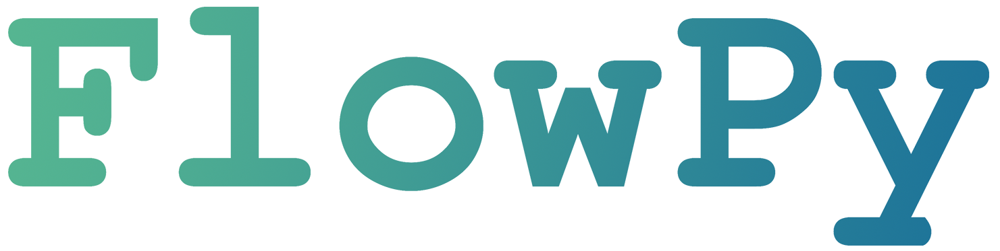

# FlowPy

A static information flow control (IFC) checker - in Python, for Python.

## Installation
1. Clone this repository: `git clone git@github.com:zsabbagh/flowpy.git` or `git clone https://github.com/zsabbagh/flowpy.git`.
2. Change directory to the project root: `cd flowpy`.
3. Install the package: `pip install .` (or `pip install -e .` for developers).

## What
[Information flow control](https://en.wikipedia.org/wiki/Information_flow_(information_theory)) is a way of monitoring and possibly restricting the flow of information within a system. It's different from many other security measures such as cryptography or access control, since it aims to show what information is being propagated to where even *after* it's been "lawfully" accessed. For example, controlling who can access a file can be a good security measure, but once it's been accessed this control can't really do much more. IFC, on the other hand, helps provide a proper overview regardless of what other procedures are in place, making it very interesting from a security standpoint.

## Why
While taking a course in language-based security (LBS) at KTH Royal Institute of Technology, we found the concept of statically checking programs for insecure information flows interesting. Combine this with a fascination for abstract syntax trees (ASTs) and a general love for programming, and this project was born :)

Despite this ''just'' being our project for the course mentioned above, we try to keep the code reasonably clean and well-commented. Any questions or input is welcome!

## How
We make heavy use of two main Python libraries: [tokenize](https://docs.python.org/3/library/tokenize.html) for parsing the comments used for telling `FlowPy` what functions to check, and [ast](https://docs.python.org/3/library/ast.html) to be able to properly analyse them.

Each time we find one or more comments asking `FlowPy` to check a function, we parse all the rules present in these comments while looking for the function name. The parsed rules are placed into a `State` object, which keeps track of the current security context and each variable's security labels, and when we find the function name we store it together with the `State`. Once the entire file has been parsed, we create a `FunctionEvaluator` for each function and start the evaluation. This traverses the AST in order, verifying each statement or expression using a set of predetermined rules. If any breaches of these rules are found, `FlowPy` will output a warning for each of these cases.

## States

- Have FlowPy as recursive or DFS-like evaluation of scopes, whereof scopes are `def`'s, etc.
- The script is treated as the entry point and all functions inherit the state from the
global `State` which belongs to the script.
- Inheritence occurs when a variable does not have any specific labels
